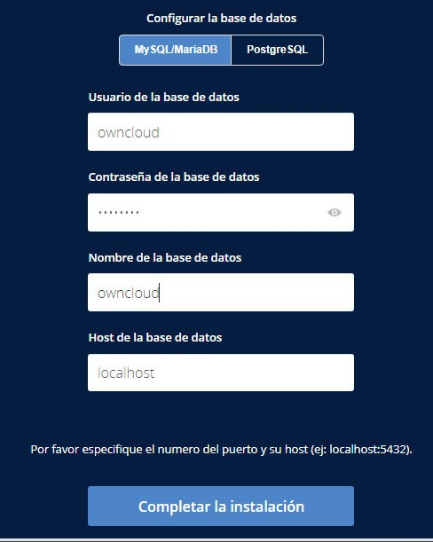

# Instalación y configuración de aplicaciones web

Para instalar una aplicación web debemos de bajar el codigo fuente y llevarlo al directorio raiz del servidor de aplicacions, en nuestro caso, `apache2`. Cuando instalemos `apache2` se creara una carpeta a `/var/www/html` donde, per defecto, el servidor web utiliza como directorio raiz.

Entonces, si llevamos nuestra aplicación al directorio `/var/www/html` tendremos acceso a la aplicación mediante la dirección wen `http://localhost`.

## Instalación de apache2, mysql y algunas librerias al contenedor

1. Actualización de la màquina.
```console
sudo apt update
```
```console
sudo apt upgrade
```

2. Instalación del servidor web `apache2`.
```console
sudo apt install -y apache2
```

3. Instalación del servidor de base de datos `mysql-server`.
```console
sudo apt install -y mysql-server
```

4. Instalación de algunas librerias de `php`, el lenguaje principal que utilizan las aplicaciones.
```console
sudo apt install -y php libapache2-mod-php
```
```console
sudo apt install -y php-fpm php-common php-mbstring php-xmlrpc php-soap php-gd php-xml php-intl php-mysql php-cli php-ldap php-zip php-curl
```

5. Reiniciamos el servidor apache2
```console
sudo systemctl restart apache2
```

## Configuración de MySQL
### Accedemos a la consola de MySQL
Desde la terminal donde seguimos en `root` debemos de ejecutar la siguiente comanda:
```console
sudo mysql
```

### Creación de la base de datos:
Una vez dentro de la consola de MySQL ejecutamos las comandas para crear la base de datos. En este caso estamos creando una base de datos con el nombre `bbdd`.

```console
CREATE DATABASE bbdd;
```

### Creación de un usuario
Tenemos en cuenta que se tendra que identificar la IP desde la que se accedera a la base de datos, en este caso, `localhost`.

```console
CREATE USER 'usuario'@'localhost' IDENTIFIED WITH mysql_native_password BY 'password';
```

### Damos privilegios al usuari:
```console
GRANT ALL ON bbdd.* to 'usuario'@'localhost';
```

### Salimos de la base de datos
```console
exit
```

### Probamos la conexión a la base de datos
Desde la terminal con un usuario que no tiene privilegios hemos de ser capaces de conectar introduciendo la contraseá.

```console
mysql -u usuario -p
```

## Descargamos los ficheros de la aplicación web
Vamos al directorio `/var/www/html` y descomprimimos los ficheros de la aplicació web, tenemos que substituir `app-web.zip` per el nom del vostre fitxer que heu descarregat amb l'aplicació web i el nom de la carpeta `app-web` per la carpeta que us ha creat.
```console
sudo cp ~/Descargas/app-web.zip /var/www/html
```
Aneu al directori `/var/www/html`
```console
cd /var/www/html
```
Descomprime el fichero que hemos descargado
```console
sudo unzip app-web.zip
```
Copia los ficheros a la carpeta `/var/www/html`, modifica `app-web` por el nombre de la carpeta la cual se ha descomprimido, en este caso OwnCloud
```console
sudo cp -R app-web/. /var/www/html
```
Eliminamos la carpeta creada cuando hicimos el l'`unzip`
```console
sudo rm -rf app-web/
```

## Eliminamos el fichero `index.html` de l'`apache2`
```console
sudo rm -rf /var/www/html/index.html
```

## Aplicación de permisos a la aplicacion web
Una vez descomprimdos los ficheros de la aplicació web al directorio `/var/www/html`, aplicamos los permisos al directorio `/var/www/html`

```console
cd /var/www/html
```
```console
sudo chmod -R 775 .
```
```console
sudo chown -R usuario:www-data .
```
## Accedemos al navegador para que veamos que todo esta correcto
 http://localhost 
* **usuario:** usuario
* **contraseña:** password
* **base de datos:** bbdd
* **dominio:** localhost

   

 ###### Hos saldra una pestaña como esta al entrar al http://localhost, rellenad los datos que hos he indicado anteriormente.
